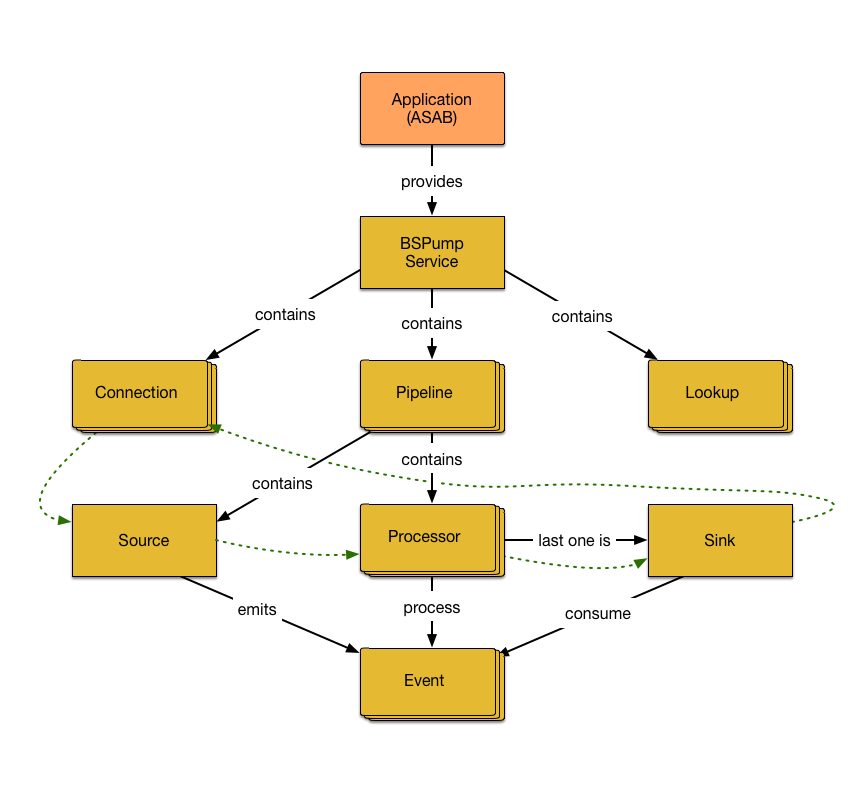

BSPump: A real-time stream processor for Python 3.5+
====================================================

.. image:: https://readthedocs.org/projects/bspump/badge/?version=latest
    :target: https://docs.libertyaces.com/?badge=latest
    :alt: Documentation Status

.. image:: https://travis-ci.com/LibertyAces/BitSwanPump.svg?branch=master
    :alt: Build status
    :target: https://travis-ci.com/LibertyAces/BitSwanPump

.. image:: https://codecov.io/gh/LibertyAces/BitSwanPump/branch/master/graph/badge.svg?sanitize=true
    :alt: Code coverage
    :target: https://codecov.io/gh/LibertyAces/BitSwanPump

.. image:: https://badges.gitter.im/TeskaLabs/bspump.svg
    :alt: Join the chat at https://gitter.im/TeskaLabs/bspump
    :target: https://gitter.im/TeskaLabs/bspump?utm_source=badge&utm_medium=badge&utm_campaign=pr-badge&utm_content=badge

Principles
----------

* Write once, use many times
* Everything is a stream
* Schema-less
* Kappa architecture
* Real-Time
* High performance
* Simple to use and well documented, so anyone can write their own stream processor
* Asynchronous via Python 3.5+ ``async``/``await`` and ``asyncio``
* `Event driven Architecture <https://en.wikipedia.org/wiki/Event-driven_architecture>`_ / `Reactor pattern <https://en.wikipedia.org/wiki/Reactor_pattern>`_
* Single-threaded core but compatible with threads
* Compatible with `pypy <http://pypy.org>`_, Just-In-Time compiler capable of boosting Python code performace more then 5x times
* Good citizen of the Python ecosystem 
* Modularized

Stream processor example
------------------------

.. code:: python

    #!/usr/bin/env python3
    import bspump
    import bspump.socket
    import bspump.common
    import bspump.elasticsearch
    
    class MyPipeline(bspump.Pipeline):
        def __init__(self, app):
            super().__init__(app)
            self.build(
                bspump.socket.TCPStreamSource(app, self),
                bspump.common.JSONParserProcessor(app, self),
                bspump.elasticsearch.ElasticSearchSink(app, self, "ESConnection")
            )
    
    
    if __name__ == '__main__':
        app = bspump.BSPumpApplication()
        svc = app.get_service("bspump.PumpService")
        svc.add_connection(bspump.elasticsearch.ElasticSearchConnection(app, "ESConnection"))
        svc.add_pipeline(MyPipeline(app))
        app.run()

Video tutorial
^^^^^^^^^^^^^^

.. image:: http://img.youtube.com/vi/QvjiPxO4w6w/0.jpg
   :target: https://www.youtube.com/watch?v=QvjiPxO4w6w&list=PLb0LvCJCZKt_1QcQwpJXqsm-AY_ty4udo

Build
-----

Docker build
^^^^^^^^^^^^
Dockerfile and instructions are in `separate repository <https://github.com/LibertyAces/docker-bspump/>`_.

PyPI release
^^^^^^^^^^^^
Releases are happening from a git tag (format: ``vYY.MM``)
``git tag -a v19.07``

Following the `PyPI packaging <https://packaging.python.org/tutorials/packaging-projects/#generating-distribution-archives>`_, generate `distribution package <https://packaging.python.org/glossary/#term-distribution-package>`_ and `upload it <https://packaging.python.org/tutorials/packaging-projects/#uploading-the-distribution-archives>`_ using following command ``python -m twine upload dist/*``

Blank application setup
-----------------------

You can clone blank application from it's `own repository <https://github.com/LibertyAces/BitSwanTelco-BlankApp>`_.

Available technologies
----------------------

* ``bspump.amqp`` AMQP/RabbitMQ connection, source and sink
* ``bspump.avro`` Apache Avro file source and sink
* ``bspump.common`` Common processors and parsers
* ``bspump.elasticsearch`` ElasticSearch connection, source and sink
* ``bspump.file`` File sources and sinks (plain files, JSON, CSV)
* ``bspump.filter`` Content, Attribute and TimeDrift filters
* ``bspump.http.client``  HTTP client source, WebSocket client sink
* ``bspump.http.web`` HTTP server source and sink, WebSocket server source
* ``bspump.influxdb`` InfluxDB connection and sink
* ``bspump.kafka`` Kafka connection, source and sink
* ``bspump.mail`` SMTP connection and sink
* ``bspump.mongodb`` MongoDB connection and lookup
* ``bspump.mysql`` MySQL connection, source and sink
* ``bspump.parquet`` Apache Parquet file sink
* ``bspump.postgresql`` PostgreSQL connection and sink
* ``bspump.slack`` Slack connection and sink
* ``bspump.socket`` TCP source, UDP source
* ``bspump.trigger`` Opportunistic, PubSub and Periodic triggers
* ``bspump.crypto`` Cryptography

  * Hashing: SHA224, SHA256, SHA384, SHA512, SHA1, MD5, BLAKE2b, BLAKE2s
  * Symmetric Encryption: AES 128, AES 192, AES 256

* ``bspump.analyzer``

  * Time Window analyzer
  * Session analyzer
  * Geographical analyzer
  * Time Drift analyzer

* ``bspump.lookup``

  * GeoIP Lookup

* ``bspump.unittest``

  * Interface for testing Processors / Pipelines

* ``bspump.web`` Pump API endpoints for pipelines, lookups etc.

Google Sheet with technological compatiblity matrix:
https://docs.google.com/spreadsheets/d/1L1DvSuHuhKUyZ3FEFxqEKNpSoamPH2Z1ZaFuHyageoI/edit?usp=sharing

High-level architecture
-----------------------

Unit test
---------

.. code:: python

    from unittest.mock import MagicMock
    from bspump.unittest import ProcessorTestCase

    class MyProcessorTestCase(ProcessorTestCase):

        def test_my_processor(self):

            # setup processor for test
            self.set_up_processor(my_project.processor.MyProcessor, "proc-arg", proc="key_arg")

            # mock methods to suit your needs on pipeline ..
            self.Pipeline.method = MagicMock()

            # .. or instance of processor
            self.Pipeline.Processor.method = MagicMock()

            output = self.execute(
                [(None, {'foo': 'bar'})]  # Context, event
            )

            # assert output
            self.assertEqual(
                [event for context, event in output],
                [{'FOO': 'BAR'}]
            )

            # asssert expected calls on `self.Pipeline.method` or `self.Pipeline.Processor.method`
            self.Pipeline.Processor.method.assert_called_with(**expected)

Running of unit tests
---------------------

``python3 -m unittest test``

You can replace ``test`` with a location of your unit test module.

Licence
-------

BSPump is an open-source software, available under BSD 3-Clause License.

