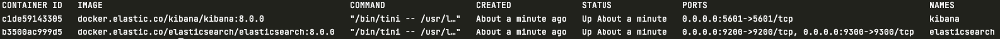
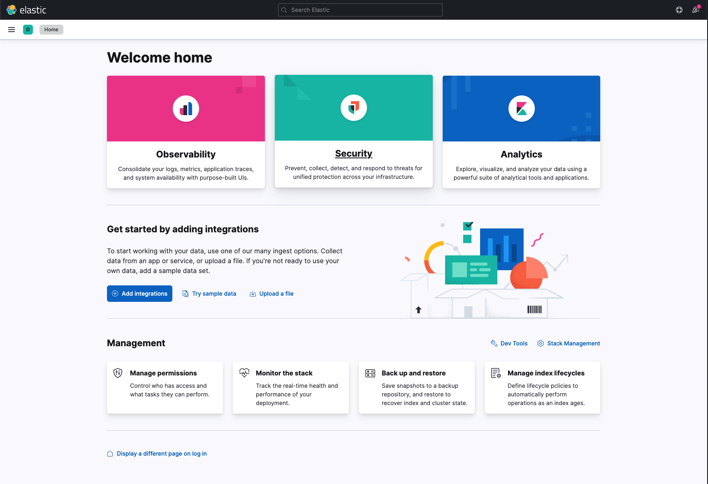
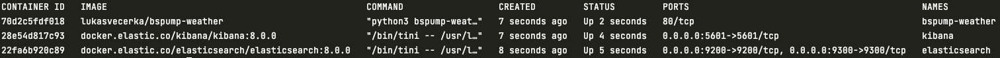
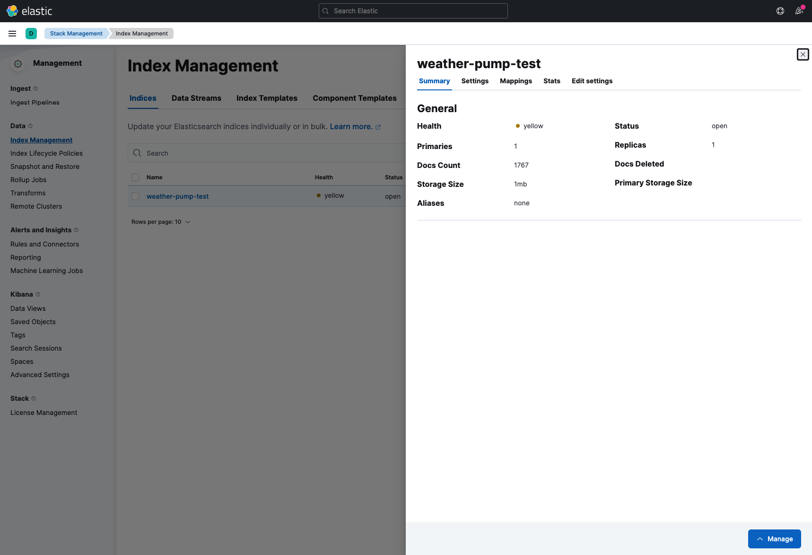

.. _dockercompose:

Install ElasticSearch and Kibana via Docker
===========================================

About
-----
This example is focused on how to install ElasticSearch and Kibana on your localhost and use the ES via Kibana GUI.
We will be using Docker and Docker compose to install ElasticSearch environment. Be sure you have set up Docker and Docker compose,
if not follow this guide to install `Docker <https://docs.docker.com/get-docker/>`_ and `Docker compose <https://docs.docker.com/compose/install/>`_.

In the end we use Docker image of our Weather Pump, which can be found here :ref:`weatherpump`, to pump data to index in our local ElasticSearch.

Docker is a platform which provides the ability to package and run an application in a loosely isolated environment called a container.
More about `Docker <https://docs.docker.com/get-started/overview/>`_ you can also read our quickstart how to use Docker with BSPump module here: :ref:`dockerquickstart`

Docker compose is a tool for defining and running multi-container Docker applications. More about `Docker compose <https://docs.docker.com/compose/>`_.

Docker compose with ES and Kibana
---------------------------------
Now we create Docker compose file to run ElasticSearch and Kibana on our localhost. Create ``docker-compose.yml`` file in your specified folder.
In docker compose you have to define your services which you want to use. In our case we define ``elasticsearch`` and ``kibana``.
We choose which image of ES and Kibana we want to use. The image will automatically download from official Docker hub of Elastic.
Then we set a names of container and set a condition when the container restart after unexpected exit. In next step we set the environment of container.
In this case we don't want to have security, we will have just one ElasticSearch single-node and we set up a connection between ES and Kibana in ``ELASTICSEARCH_HOSTS``.
Volumes is where the data will be stored in container file system. And in the end we specified on which localhost port container will be running.
You can also set that one service will be wait for another in ``depends_on``.

Just copy-paste this chunk of code into your ``docker-compose.yml`` file:
::
    version: '3.9'
    services:
      # Elastic Search single node cluster
      elasticsearch:
        image: docker.elastic.co/elasticsearch/elasticsearch:8.0.0
        container_name: elasticsearch
        restart: always
        environment: 
          - xpack.security.enabled=false
          - discovery.type=single-node
        volumes: 
          - elasticsearch-data-volume:/usr/share/elasticsearch/data/
        ports: 
          - 9200:9200
          - 9300:9300
      # Kibana UI for Elastic Search  
      kibana:
        image: docker.elastic.co/kibana/kibana:8.0.0
        container_name: kibana
        restart: always
        environment: 
          - ELASTICSEARCH_HOSTS=http://elasticsearch:9200
        ports: 
          - 5601:5601
        depends_on: 
          - elasticsearch

    volumes:
      elasticsearch-data-volume:
        driver: local

Now when we have defined your docker compose file we can try to run our first Docker compose app. Be sure you are in same folder like your
docker-compose file and type ``~ docker compose up -d`` into terminal.
The ``-d`` flag means that your app will be running in detached mode. You can check
if all containers are running with ``docker ps`` command.

You should see this:

You can also enter the Kibana GUI. Go to your browser and type ``localhost:5601`` into search bar. You can see that you type localhost port which
we define in the docker compose file.

Wow! If everything is okay you will see this:

Run Weather pump to pump data to Elastic Search index
-----------------------------------------------------
Well done! We installed ElasticSearch and Kibana locally and we are able to access the ElasticSearch with Kibana GUI.
Now we can try to run pump which take weather data and we store them in Elasticsearch index. We already build Weather pump
image so you basically pull the image from Docker hub and run it.

To do it simply run this command in your terminal:
::
    ~ docker run --network=host -dit lukasvecerka/bspump-weather

You have to set ``--network=host`` which mean that your container can now access the localhost on your host machine.

If you type ``docker ps`` the incoming output in terminal should be this:

Now go to `this <http://localhost:5601/app/management/data/index_management/indices>`_ url address. Its page of Index Management where you can
see all of your stored indexes.

If your containers are running correctly you can see that there is index called ``weather-pump-test``. This is the index where we store data from
our weather pump.

Summarize
---------
That's all for this example! In this example we learnt how to work with Docker and especially with Docker compose tool. How to set services in
our application in Docker compose. As conclusion we installed ElasticSearch and Kibana locally and pump data on index in ElasticSearch with our pump.

What next
---------
In the future you can add more services into your docker compose application and extend your environment with this services. You can build your
own Docker image and push it to Docker hub and then use it in your docker compose.

More about how to create BSPump Docker image is here :ref:`dockerquickstart`