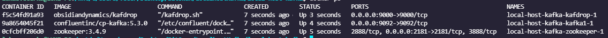
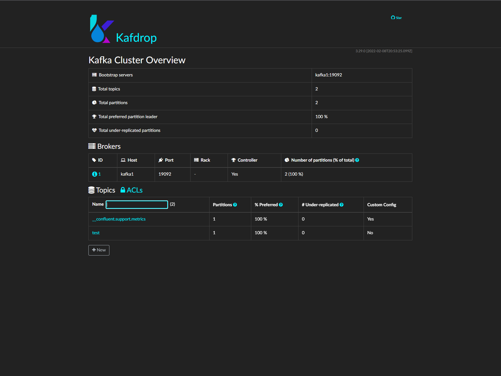
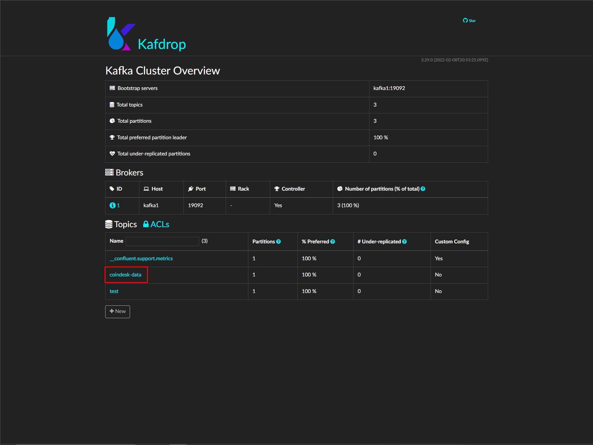
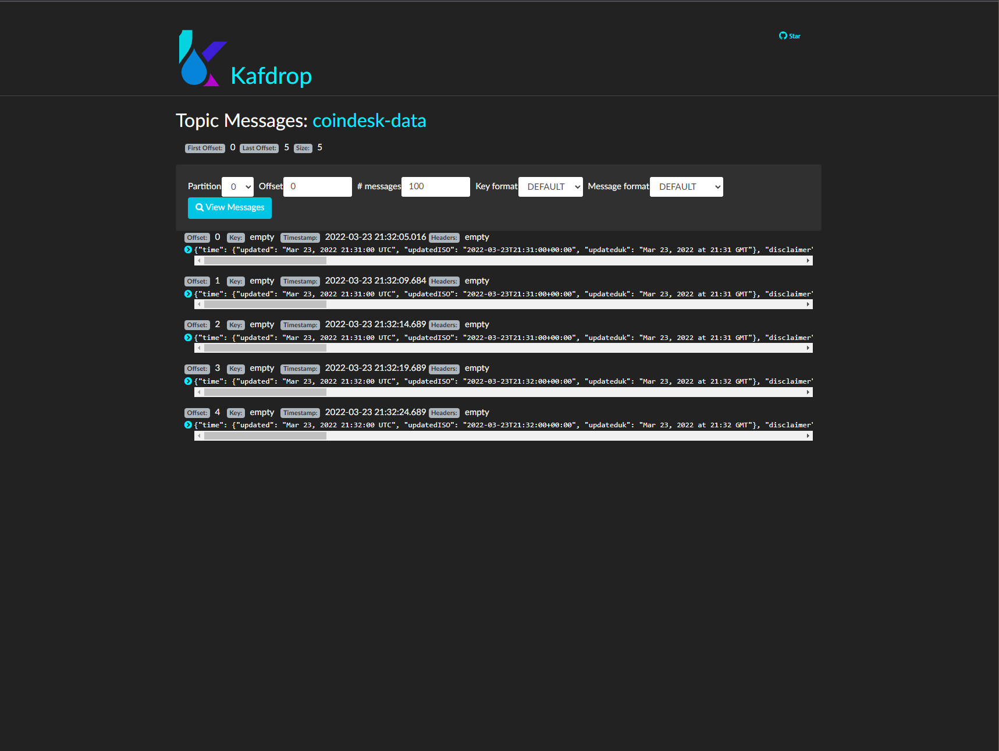

.. _installkafka:

Install Kafka and KafDrop via Docker
====================================

About
-----
This example is focused on how to install Kafka nad KafDrop on your localhost and search topics from Kafka in KafDrop.
We will be using Docker and Docker Compose to install ElasticSearch environment. Be sure you have set up Docker and Docker Compose.
If not follow this guide to install `Docker <https://docs.docker.com/get-docker/>`_ and `Docker compose <https://docs.docker.com/compose/install/>`_.

In the end we will use Docker image of our Coindesk API pump, which can be found here :ref:`coindesk`, to pump data to topic in our local Kafka.

Docker is a platform which provides the ability to package and run an application in a loosely isolated environment called a container.
More about `Docker <https://docs.docker.com/get-started/overview/>`_.

You can also read our quickstart how to use Docker with BSPump module here: :ref:`dockerquickstart`

Docker compose is a tool for defining and running multi-container Docker applications. More about `Docker compose <https://docs.docker.com/compose/>`_.

Docker compose with Kafka and KafDrop
-------------------------------------
Now we create Docker Compose file to run Kafka and KafDrop on our localhost. Create ``docker-compose.yml`` file in our desired folder.
In docker compose you have to define your services which you want to use. Each service is one container which will be running.
In our case we define ``zookeeper``, ``kafka`` and ``kafdrop``. ZooKeeper is essentially a service for distributed systems offering a hierarchical key-value store,
which is used to provide a distributed configuration service, synchronization service, and naming registry for large distributed systems.

Services are consist of these values:

1. `image`: we choose which image will be download from DockerHub (after we run the docker compose its automatically pull the image)
2. `hostname`: name of service in multi-container network
3. `ports`: specified ports where the container will runs
4. `environments`: setting up the services configuration (e.g. Kafka Broker ID etc.)
5. `depends_on`: service will wait until specified service in depends_on will start
6. `restart`: service try to restart after unexpected end

Just copy-paste this chung od code into you ``docker-compose.yml`` file:
::
    version: '3.9'
    services:
      zookeeper:
        image: zookeeper:3.4.9
        hostname: zookeeper
        ports:
          - "2181:2181"
        environment:
          ZOO_MY_ID: 1
          ZOO_PORT: 2181
          ZOO_SERVERS: server.1=zookeeper:2888:3888
        volumes:
          - /data/zookeeper/data:/data
          - /data/zookeeper/datalog:/datalog

      kafka1:
        image: confluentinc/cp-kafka:5.3.0
        hostname: kafka1
        ports:
          - "9092:9092"
        environment:
          KAFKA_ADVERTISED_LISTENERS: LISTENER_DOCKER_INTERNAL://kafka1:19092,LISTENER_DOCKER_EXTERNAL://${DOCKER_HOST_IP:-127.0.0.1}:9092
          KAFKA_LISTENER_SECURITY_PROTOCOL_MAP: LISTENER_DOCKER_INTERNAL:PLAINTEXT,LISTENER_DOCKER_EXTERNAL:PLAINTEXT
          KAFKA_INTER_BROKER_LISTENER_NAME: LISTENER_DOCKER_INTERNAL
          KAFKA_ZOOKEEPER_CONNECT: "zookeeper:2181"
          KAFKA_BROKER_ID: 1
          KAFKA_OFFSETS_TOPIC_REPLICATION_FACTOR: 1
        volumes:
          - /data/kafka1/data:/var/lib/kafka/data
        depends_on:
          - zookeeper

      kafdrop:
        image: obsidiandynamics/kafdrop
        restart: "no"
        ports:
          - "9000:9000"
        environment:
          KAFKA_BROKERCONNECT: "kafka1:19092"
        depends_on:
          - kafka1

Now when we have defined your docker compose file we can try to run our first Docker compose app. Be sure you are in same folder like your
docker-compose file and type ``~ docker compose up -d`` into terminal.
The ``-d`` flag means that your app will be running in detached mode. You have to wait little bit
when all the images is pulled. After that you can check
if all containers are running with ``docker ps`` command.

You should see this:

You can also enter the KafDrop. Go to your browser and type ``localhost:9000``
to the search bar. You can see that you specify the port that we setup in docker compose.

Wow! If everything work correctly you can see thin page:

Try to pump data Kafka topic
----------------------------
Well done! We've installed Kafka and KafDrop locally and we are able to see topics in KafDrop. Now we can try to
run pump which take data from CoinDesk API and store them in Kafka topic. We already build the Coindesk pump image
so you basically use the image and run it.

Simply type this command to your terminal and we will see what's happen.
::
    ~ docker run --network=host -dit lukasvecerka/bspump-kafkasink-example

You have to set ``--network=host`` which mean that your container can now access the localhost on your host machine.

Now when you look into KafDrop you can see ``coindesk-data`` topic:

You can look on messages which you pump to this topic. Just click on topic name, then on ``View Messages`` and again on ``View Messages``
and you should see something like this:

Summarize
---------
That's all for this example! In this example we learnt how to work with Docker and especially with Docker compose tool.
We learnt how to set services in our application in Docker compose. In the end we installed Kafka, Zookeeper and KafDrop
locally and we run pump with Docker container to pump data to Kafka topic.

What next
---------

In the future you can add more services into your docker compose application nad extend your environment with this services.
You can build your own Docker image and push it to Docker hub and then use it in your docker compose or simply run it as a container.

More about how to create BSPump Docker image is here :ref:`dockerquickstart`