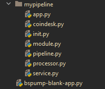

Blank App
=========

In this tutorial you will learn how divide a pipeline into several file components. This approach is beneficial for creating
more advanced pipelines as you can use some of the components without the need of copy pasting code. It is also much more clear.
This is a general guide so you can apply this structure to your pipeline. We will be using so-called blank app in
this tutorial for simplicity you can find the code `here <https://github.com/LibertyAces/BitSwanPump-BlankApp>`_.

In this tutorial we will use code from our previous tutorial :ref:`coindesk`, but don't worry once you create this structure
it is easy to make changes for your own pipeline.

first you will create similar file hierarchy like on this image.

pipeline
--------

In this file you will have your pipelien with ``self.build`` method. If you want to use your own processors, sources
or sinks you have to import them from another file. In this example I want to use my processor for coindesk, so I have to use

::

    from .processor import EnrichProcessor

and then I can reference it in ``self.build`` method.

::

    import bspump
    import bspump.common
    import bspump.http
    import bspump.trigger

    from .processor import EnrichProcessor

    class SamplePipeline(bspump.Pipeline):

        def __init__(self, app, pipeline_id):
            super().__init__(app, pipeline_id)

            self.build(
                # Source that GET requests from the API source.
                bspump.http.HTTPClientSource(app, self, config={
                    'url': 'https://api.coindesk.com/v1/bpi/currentprice.json'
                    # Trigger that triggers the source every second (based on the method parameter)
                }).on(bspump.trigger.PeriodicTrigger(app, 5)),
                # Converts incoming json event to dict data type.
                bspump.common.StdJsonToDictParser(app, self),
                # Adds a CZK currency to the dict
                EnrichProcessor(app, self),
                bspump.common.StdDictToJsonParser(app,self),
                # prints the event to a console
                bspump.common.PPrintSink(app, self),
            )

Only remember that name of your pipeline (the name of the class) will be used in other files.

processor
---------

To create processor file you can simply copy-paste your processor class.

:note: Do not forget to import bspump module, so your processor can function normally.

::

    import bspump

    class EnrichProcessor(bspump.Processor):
        def __init__(self, app, pipeline, id=None, config=None):
            super().__init__(app, pipeline, id=None, config=None)

        def convertUSDtoJPY(self, usd):
            return usd * 113.70  # outdated rate usd/jpy

        def process(self, context, event):
            jpyPrice = str(self.convertUSDtoJPY(event["bpi"]["USD"]["rate_float"]))

            event["bpi"]["JPY"] = {
                "code": "JPY",
                "symbol": "&yen;",
                "rate": ''.join((jpyPrice[:3], ',', jpyPrice[3:])),
                "description": "JPY",
                "rate_float": jpyPrice
            }

            return event

service
-------

In service you have to register your pipeline. You can also register more pipelines.

:note: Remember to import your pipeline class here, so you can register the pipeline.

::

    import asab

    from .pipeline import SamplePipeline

    class BlankService(asab.Service):

        def __init__(self, app, service_name="blank.BlankService"):
            super().__init__(app, service_name)

        async def initialize(self, app):
            svc = app.get_service("bspump.PumpService")

            # Create and register all connections here

            # Create and register all matrices here

            # Create and register all lookups here

            # Create and register all pipelines here

            self.SamplePipeline = SamplePipeline(app, "SamplePipeline")
            svc.add_pipeline(self.SamplePipeline)

            await svc.initialize(app)

::

    self.SamplePipeline = SamplePipeline(app, "SamplePipeline")
    svc.add_pipeline(self.SamplePipeline)

These two lines of the code register your pipeline.

module
------

In module you create a module of your service. You can create more modules from several services.

::

    import asab

    from .service import BlankService

    class BlankModule(asab.Module):
        def __init__(self, app):
            super().__init__(app)

            self.BlankService = BlankService(app)

app
---

In app you create the whole application. You have to only include the module you have created. You can include more modules here.

::

    import bspump

    class BlankAppApplication(bspump.BSPumpApplication):

        def __init__(self):
            super().__init__()

            from .module import BlankModule
            self.add_module(BlankModule)

init
----

create this file for initialization of your pipeline.

::

    from .app import BlankAppApplication

how to start the pipeline
-------------------------

to start your pipeline create another file. For example, ``bspump-blank-app.py`` and copy-paste this code

::

    from mypipeline.app import BlankAppApplication

    if __name__ == '__main__':
        app = BlankAppApplication()
        app.run()

``mypipeline.app`` is the path to your ``app`` python file. and ``BlankAppApplication`` is the name of your pipeline class.

Then you create an object of your class and run it.

