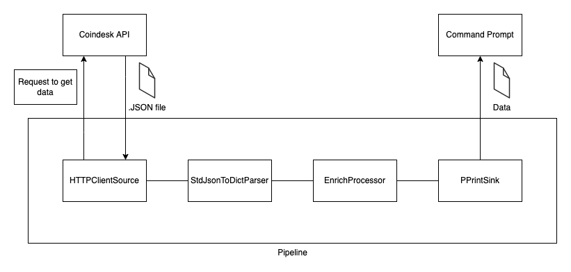

.. _coindesk:

Coindesk API Example
====================

About
-----

In this example we will learn how get data from an HTTP-like source.
We will be using HTTP Client Source for the API request.

In this example we will be using API from `Coindesk <https://www.coindesk.com/>`_ to get current price of Bitcoin.

The final pipeline will simply get data from the API request as a JSON, covert it to python dictionary and output the
data to Command Prompt. Additionally, I will show you how to create your own processor that in this example will enrich
the data.

The following code can be found
`here <https://github.com/LibertyAces/BitSwanPump/blob/feature/restructured-text/examples/bspump-http.py>`_ in our GitHub repo.

This is diagram how the finished pipeline will looks like

Source and Sink
---------------

In the code below you can see the basic structure of a pipeline. The important part is the ``self.build()`` method where its
parameters are the single components of the pipeline. In this part we will use two main components each pipeline has to have:
Source and Sink.

::

   class SamplePipeline(bspump.Pipeline):

       def __init__(self, app, pipeline_id):
           super().__init__(app, pipeline_id)

           self.build(
               bspump.http.HTTPClientSource(app, self, config={
                   'url': 'https://api.coindesk.com/v1/bpi/currentprice.json'
               }).on(bspump.trigger.PeriodicTrigger(app, 5)),
               bspump.common.PPrintSink(app, self),
           )

Source is the source of data. In our example we will use a specific type of source. Because we need
to Pump data from API. We need to send request to the API to receive our data. This means that our source has to be
"triggered" when we get our response. For this reason we will be using so-called trigger source. More about :ref:`trigger` .

HTTP Client Source can have many configurations, but in our example we just need to specify our URL address, using
``config={'url': '<OUR URL>'}``  as parameter in HTTP Client Source.

Because we are using Trigger Source. We need to specify which trigger we will be using. There are more types of
triggers, but in our example we will be using PeriodicTrigger, which triggers in time intervals specified in the
parameter. ``bspump.trigger.PeriodicTrigger(app, <<Time parameter in seconds>>))``

Each pipeline has to have sink. In our example we want to see the result of the data, so we will be using PPrintSink
which simply prints the data to the Command Prompt.

You can try to copy paste this chunk of code and try it yourself. Make use you have BSPump module installed, if not you
can follow our guide :ref:`bsmodule` .

::

   #!/usr/bin/env python3
   import logging

   import bspump
   import bspump.common
   import bspump.http
   import bspump.trigger

   class SamplePipeline(bspump.Pipeline):

       def __init__(self, app, pipeline_id):
           super().__init__(app, pipeline_id)

           self.build(
               bspump.http.HTTPClientSource(app, self, config={
                   'url': 'https://api.coindesk.com/v1/bpi/currentprice.json'
               }).on(bspump.trigger.PeriodicTrigger(app, 5)),
               bspump.common.PPrintSink(app, self),
           )

   if __name__ == '__main__':
       app = bspump.BSPumpApplication()
       svc = app.get_service("bspump.PumpService")
       pl = SamplePipeline(app, 'SamplePipeline')
       svc.add_pipeline(pl)
       app.run()

Your First processor
--------------------

After we have a functional pipeline. We can start with the more interesting part, the processors. Processor is the
component which works with data in the event. In this example we will use a simple processor which only converts the
incoming JSON to python Dict type, which is much more easier to work with and it is clearer.

::

   class SamplePipeline(bspump.Pipeline):

       def __init__(self, app, pipeline_id):
           super().__init__(app, pipeline_id)

           self.build(
               bspump.http.HTTPClientSource(app, self, config={
                   'url': 'https://api.coindesk.com/v1/bpi/currentprice.json'
               }).on(bspump.trigger.PeriodicTrigger(app, 5)),
               bspump.common.StdJsonToDictParser(app, self),
               bspump.common.PPrintSink(app, self),
           )

Processor is added simply by adding it to ``self.build()`` between source and sink.

Creating Custom processor
-------------------------

Because most of your use cases will be unique, it is most likely that there will be no existing processor that could do
the work. So you will have to implement your own processor.

Creating new processor is not a complicated task. You will need to follow the basic structure of an general processor.
You can simply copy-paste the code below:

::

   class EnrichProcessor(bspump.Processor):
    def __init__(self, app, pipeline, id=None, config=None):
        super().__init__(app, pipeline, id=None, config=None)

    def process(self, context, event):

        return event

This class is the class of your processor. The most important part of processor is the process method. This method will
be called when an event is passed to the processor. As you can see, the default implementation of process method
returns the event `return event`. Event must be always passed to the following component, another processor or sink.

If you wish to use your new processor in our case `EnrichProcessor` You will need to reference it in `self.build` method.
You can do that simply by adding it to `self.build` parameters.

::

   class SamplePipeline(bspump.Pipeline):

       def __init__(self, app, pipeline_id):
           super().__init__(app, pipeline_id)

           self.build(
               bspump.http.HTTPClientSource(app, self, config={
                   'url': 'https://api.coindesk.com/v1/bpi/currentprice.json'
               }).on(bspump.trigger.PeriodicTrigger(app, 5)),
               bspump.common.StdJsonToDictParser(app, self),
               EnrichProcessor(app, self),
               bspump.common.PPrintSink(app, self),
           )

Last step is the implementation. In our example I created a simple script that takes the incoming event (python
dictionary that contains price of Bitcoin in USD, Euro, and Pounds) and adds a new branch with a Japanese yen. There is
also a new method `convertUSDtoJPY` that calculates the price of yen based on USD conversion rate
(Note: the exchange rate is outdated for sake of simplicity of this example).

::

   class EnrichProcessor(bspump.Processor):
    def __init__(self, app, pipeline, id=None, config=None):
        super().__init__(app, pipeline, id=None, config=None)

    def convertUSDtoJPY(self, usd):
        return usd * 113.70 #outdated rate usd/jpy

    def process(self, context, event):
        jpyPrice = str(self.convertUSDtoJPY(event["bpi"]["USD"]["rate_float"]))

        event["bpi"]["JPY"] = {
            "code": "JPY",
            "symbol": "&yen;",
            "rate": ''.join((czkPrice[:3], ',', czkPrice[3:])),
            "description": "JPY",
            "rate_float": jpyPrice
        }

        return event

When we add all parts together we get this functional code.

.. literalinclude :: BitSwanPump/examples/bspump-coindesk.py
   :language: python

To Summarize what we did in this example:

1. we created a sample pipeline with a source and sink
2. We added a new processor that converts incoming events to python dictionary
3. we created a custom processor that adds a information about Japanese currency to the incoming event and passes it to sink .

Next steps
----------

You can change and modify the pipeline in any manner you want. For example, instead of using PPrintSink you can use our
Elastic Search Sink which loads the data to Elastic Search. If you want to read more about :ref:`esconnection` .

