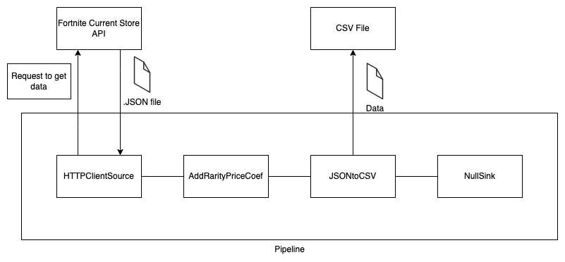
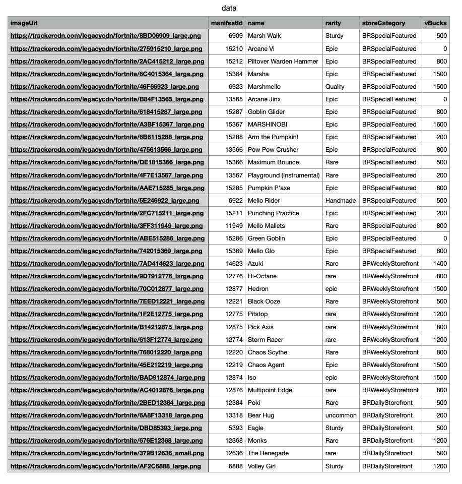
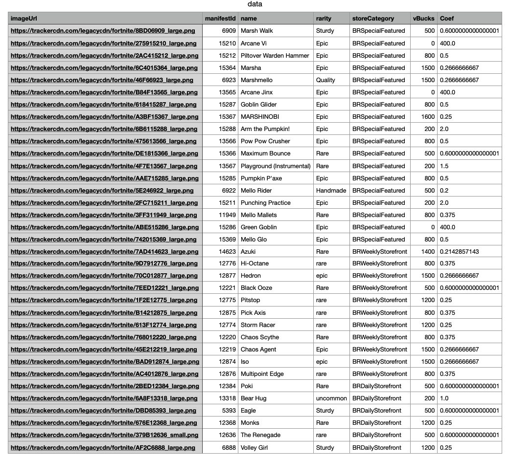
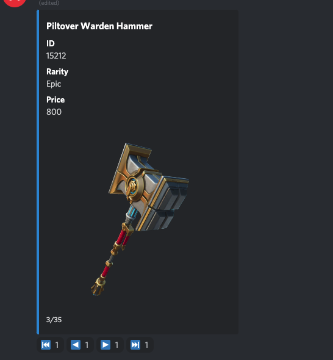

Fortnite Current Store Example
==============================
About
-----
In this example we will get data from one HTTP course using an API request and use filtering processors on those datas

and export the data to ``.csv`` file which can be used for example for Discord bot.

The final pipeline will get data form API request, filter some values from dataframe, does some calculation with values

and then export it to CSV file.

We will be using API from `Fortnite Tracker <https://fortnitetracker.com/site-api>`_ to get current Fortnite store items.

We will work with configuration files in this example. If you already doesn't know how to work with configuration files
try this quickstart :ref:`config`.

A diagram of the finished pipeline

First sample pipeline
---------------------
In the code below you can see the structure of ``SamplePipeline`` which we need for this use case. The important part is the
``self.build()`` method where its parameters are the single components of the pipeline. Do not forget that every pipeline
requires both source and sink to function correctly.

`Source` is a component that supply the pipeline with data. In our example we will use a specific type of source. Because we need
to Pump data from API, we need to send request to the API to receive our data. This means that our source has to be
“trigger” the request and send it to the API. For this reason we will be using a so-called trigger source. More about :ref:`trigger`.

Because we are using `Trigger Source`. We need to specify which trigger we will be using. There are more types of triggers,
but in our example we will be using PeriodicTrigger, which triggers in time intervals specified in the parameter.
``bspump.trigger.PeriodicTrigger(app, <<Time parameter in seconds>>))``

Each pipeline requires a sink. We will use PPrintSink for now to see incoming data. But in the next steps we will be
using NullSink which I describe later.

First we need to create configuration file. Create ``config.conf`` file in your pump folder. To this configuration file
copy-paste this chunk of code and rewrite ``<YOUR PRIVATE API>`` section with your API key which you will get by
following steps `here <https://fortnitetracker.com/site-api>`_
::
    [pipeline:SamplePipeline]
    url = https://api.fortnitetracker.com/v1/store
    api_key = <YOUR PRIVATE API KEY>

After you have your configuration file finished you can copy-paste code below and try it yourself. Be sure you have
BSPump module installed. If not follow our guide :ref:`bsmodule`
::
    import bspump
    import bspump.common
    import bspump.http
    import bspump.trigger

    class SamplePipeline(bspump.Pipeline):
        def __init__(self, app, pipeline_id):
            super().__init__(app, pipeline_id)
            self.build(
                bspump.http.HTTPClientSource(app, self,
                config={'url': self.Config['url']},
                headers={'TRN-Api-Key': self.Config['api_key']}).on(bspump.trigger.PeriodicTrigger(app, 2)),
                bspump.common.PPrintSink(app, self),
            )

    if __name__ == '__main__':
        app = bspump.BSPumpApplication()

        svc = app.get_service("bspump.PumpService")

        # Construct and register Pipeline
        pl = SamplePipeline(app, 'SamplePipeline')
        svc.add_pipeline(pl)

        app.run()

You can run this code with ``~ python3 yourpumpname.py -c config.conf`` command in terminal. Well done! Now we are
pumping data about items which are in Fortnite store right now.

You should get output like this:
::
    ~ python3 docs1.py -c config.conf
    BitSwan BSPump version 21.11-17-g6b346fd
    04-Feb-2022 18:00:30.503021 NOTICE asab.application is ready.
    1 pipeline(s) ready.
    (b'[\r\n  {\r\n    "imageUrl": "https://trackercdn.com/legacycdn/fortnite/8BD06'
     b'909_large.png",\r\n    "manifestId": 6909,\r\n    "name": "Marsh Walk",\r'
     b'\n    "rarity": "Sturdy",\r\n    "storeCategory": "BRSpecialFeatured",\r'
     b'\n    "vBucks": 500\r\n  },\r\n  {\r\n    "imageUrl": "https://trackercdn.c'
     b'om/legacycdn/fortnite/275915210_large.png",\r\n    "manifestId": 15210,\r\n '
     b'   "name": "Arcane Vi",\r\n    "rarity": "Epic",\r\n    "storeCategory": "BR'
     b'SpecialFeatured",\r\n    "vBucks": 0\r\n  },\r\n  {\r\n    "imageUrl": "http'
     b's://trackercdn.com/legacycdn/fortnite/2AC415212_large.png",\r\n    "manife'
     b'stId": 15212,\r\n    "name": "Piltover Warden Hammer",\r\n    "rarity": "Epi'
     b'c",\r\n    "storeCategory": "BRSpecialFeatured",\r\n    "vBucks": 800\r\n '
     b' },\r\n  {\r\n    "imageUrl": "https://trackercdn.com/legacycdn/fortnite/6C4'
     b'015364_large.png",\r\n    "manifestId": 15364,\r\n    "name": "Marsha",\r'
     b'\n    "rarity": "Epic",\r\n    "storeCategory": "BRSpecialFeatured",\r\n '
     b'   "vBucks": 1500\r\n  },\r\n  {\r\n    "imageUrl": "https://trackercdn.co'
     b'm/legacycdn/fortnite/46F66923_large.png",\r\n    "manifestId": 6923,\r\n    '
     b'"name": "Marshmello",\r\n    "rarity": "Quality",\r\n    "storeCategory": "B'
     b'RSpecialFeatured",\r\n    "vBucks": 1500\r\n  },\r\n  {\r\n    "imageUrl": "'
     b'https://trackercdn.com/legacycdn/fortnite/B84F13565_large.png",\r\n    "ma'
     b'nifestId": 13565,\r\n    "name": "Arcane Jinx",\r\n    "rarity": "Epic",'
     b'\r\n    "storeCategory": "BRSpecialFeatured",\r\n    "vBucks": 0\r\n  },\r\n'
     b'  {\r\n    "imageUrl": "https://trackercdn.com/legacycdn/fortnite/61841528'
     b'7_large.png",\r\n    "manifestId": 15287,\r\n    "name": "Goblin Glider"'
     b',\r\n    "rarity": "Epic",\r\n    "storeCategory": "BRSpecialFeatured",\r'
     b'\n    "vBucks": 800\r\n  },\r\n ...

Export to CSV
-------------
Awesome! Now we are pumping data but we want to store them somewhere. In the end we want to create Discord Bot which will
show us current Fortnite Store when we write command to discord chat. Discord bot can work easily with CSV file so we
need to export our data do `.csv` file.

We have to import `pandas` library to our pump which can export JSON file to CSV file and then we define our exporting processor.

The processor convert JSON file to dataframe with pandas library and then export it as CSV file and create specified file
in same folder like our pump (you can define path you want).

This will be our processor:
::
    class JSONtoCSV(bspump.Processor):

        def process(self, context, event):
            df = pd.read_json(event)
            event = df.to_csv('data.csv', index=False)
            return event

Now we add this processor to our pump, we have to change PPrintSink to NullSink because we don't want to store or print
data anywhere, we will have it in our CSV file.

You can copy-paste code below and look into your pump folder if there is a CSV file with our data.
::
    import bspump
    import bspump.common
    import bspump.http
    import bspump.trigger
    import pandas as pd

    class JSONtoCSV(bspump.Processor):

            def process(self, context, event):
                df = pd.read_json(event)
                event = df.to_csv('data.csv', index=False)
                return event

    class SamplePipeline(bspump.Pipeline):
        def __init__(self, app, pipeline_id):
            super().__init__(app, pipeline_id)

            self.build(
                bspump.http.HTTPClientSource(app, self,
                config={'url': self.Config['url']},
                headers={'TRN-Api-Key': self.Config['api_key']}).on(bspump.trigger.PeriodicTrigger(app, 2)),
                JSONtoCSV(app, self),
                bspump.common.NullSink(app, self),
            )

    if __name__ == '__main__':
        app = bspump.BSPumpApplication()

        svc = app.get_service("bspump.PumpService")

        # Construct and register Pipeline
        pl = SamplePipeline(app, 'SamplePipeline')
        svc.add_pipeline(pl)

        app.run()

The CSV file should looks this way:

Processor with pandas script
----------------------------
You can see that in our data set there aren't so many interesting datas. So we want to add column with coefficient of
price over rarity which will be useful in our Discord bot, because player could know which items is the most advantageous
for purchase.

We create basic pandas script to go through rows and calculate the coefficient from rarity and vBucks column values
and then add to list which will create new column called `Coef` at the end. More about pandas `here <https://pandas.pydata.org/docs/>`_

You have to convert the dataframe back to JSON file, because pipeline can't work with dataframes.

The processor:
::
    class AddRarityPriceCoef(bspump.Processor):

        def process(self, context, event):
            df = pd.read_json(event)
            coefs = []
            for row in df.itertuples():
                if row.vBucks == 0:
                    price = 1
                else:
                    price = row.vBucks
                if row.rarity.lower() == 'handmade':
                    coefs.append((1/price)*100)
                elif row.rarity.lower() == 'uncommon':
                    coefs.append((2/price)*100)
                elif row.rarity.lower() == 'rare':
                    coefs.append((3/price)*100)
                elif row.rarity.lower() == 'epic':
                    coefs.append((4/price)*100)
                elif row.rarity.lower() == 'legendary':
                    coefs.append((5/price)*100)
                elif row.rarity.lower() == 'mythic':
                    coefs.append((6/price)*100)
                elif row.rarity.lower() == 'exotic':
                    coefs.append((7/price)*100)
            df['Coef'] = coefs
            event = df.to_json()
            return event

Now we add the processor to our pump and after you copy-paste the code and run the pump you can see that the new column
was added with our calculated values.
::
    #!/usr/bin/env python3

    import bspump
    import bspump.common
    import bspump.http
    import bspump.trigger
    import pandas as pd

    class JSONtoCSV(bspump.Processor):

        def process(self, context, event):
            df = pd.read_json(event)
            print(df)
            event = df.to_csv('data.csv', index=False)
            return event

    class AddRarityPriceCoef(bspump.Processor):

        def process(self, context, event):
            df = pd.read_json(event)
            coefs = []
            for row in df.itertuples():
                if row.vBucks == 0:
                    price = 1
                else:
                    price = row.vBucks
                if row.rarity.lower() == 'handmade':
                    coefs.append((1/price)*100)
                elif row.rarity.lower() == 'uncommon':
                    coefs.append((2/price)*100)
                elif row.rarity.lower() == 'rare':
                    coefs.append((3/price)*100)
                elif row.rarity.lower() == 'epic':
                    coefs.append((4/price)*100)
                elif row.rarity.lower() == 'legendary':
                    coefs.append((5/price)*100)
                elif row.rarity.lower() == 'mythic':
                    coefs.append((6/price)*100)
                elif row.rarity.lower() == 'exotic':
                    coefs.append((7/price)*100)
            df['Coef'] = coefs
            event = df.to_json()
            return event

    class SamplePipeline(bspump.Pipeline):
        def __init__(self, app, pipeline_id):
            super().__init__(app, pipeline_id)
            self.build(
                bspump.http.HTTPClientSource(app, self,
                config={'url': self.Config['url']},
                headers={'TRN-Api-Key': self.Config['api_key']}).on(bspump.trigger.PeriodicTrigger(app, 2)),
                # Add price over rarity coefficient to dataframe
                AddRarityPriceCoef(app, self),
                # Converts incoming json event to CSV data
                JSONtoCSV(app, self),
                # We can also push datas to ES or Kafka
                bspump.common.NullSink(app, self),
            )

    if __name__ == '__main__':
        app = bspump.BSPumpApplication()

        svc = app.get_service("bspump.PumpService")

        # Construct and register Pipeline
        pl = SamplePipeline(app, 'SamplePipeline')
        svc.add_pipeline(pl)

        app.run()

Data in CSV file:

Conclusion
----------
So, in this example we learnt how to get data from basic API request and export it to CSV file. Then we create script
with pandas library to make price over rarity coefficient and add it as a new column to our dataset. You can also add
some other processors which can filter data or make some calculation over the datas.

What next?
----------
Now I will show you how can you use the pump to create your Discord bot for yourself or your friends.

You can find how to create Discord bot `here <https://realpython.com/how-to-make-a-discord-bot-python/>`_

The following discord bot can looks like this:

