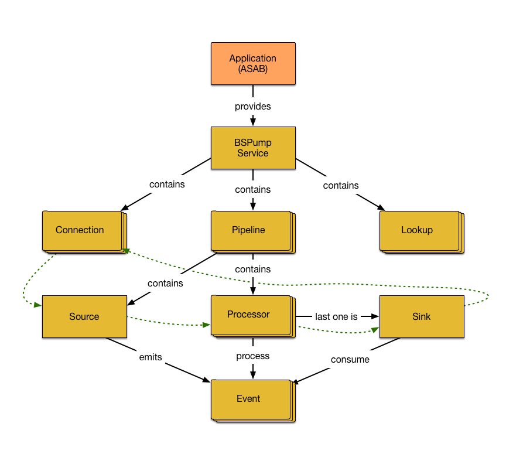

Bitswan Tutorials
=================

in this series of tutorials we will walk you through basic and more advanced examples and demos
to initiate your adventure with BSPump.

You will learn more about the BSPump architecture and how each component works. However, before you can
start on your journey you should know basics of python and be able to set up your programming environment.

Prerequisites
=============

Here are some quick tutorials that will help you installing python and BSPump module using package installer for Python called pip.

Installing python
-----------------

Firstly you should check whether you don't already have python installed. Open your command line or terminal and type: ::

    C:/> python --version
    > Python 3.8.4

if your python version is lower than 3.8 check `Python.org <https://www.python.org/>`_

If you are a complete beginner to python or you want more information
about python check out the `Python tutorial <https://docs.python.org/3/tutorial/index.html>`_

Installing BSPump module
------------------------

To install BSPump module: ::

    pip install asab bspump

or alternatively using ::

    pip install git+https://github.com/LibertyAces/BitSwanPump-BlankApp.git

If you dont have installed pip type: ::

    python get-pip.py

To check the version use. ::

    pip --version

Have you managed to install everything? Then you are ready for creating your first BSPump.

BSPump Highlevel architecture
=============================

BSPump is made from several components which are going to be explained in this tutorial. As you probably know, Bitswan is a real-time stream processor.
To be able to process and work with large amount of data, BSpump uses so-called Event Stream Processing, data is propagated through a data pipeline in Events.
Event is a single "atomical" data point with a timestamp. To handle these events Pipeline has special components that must work compatibly
.Therefore, each pipeline is made from several vital compoents: source, processor and sink. However, for the pipeline to work Bitswan uses BSPump Service
to handle and register connetions, pipelines etc.

Firstly, we will walk you through each of components and its functionality, so you can later build your own pipeline. Doesn't that sounds cool?

BSpump Service
--------------

Service is part where pipelines and connections are registered.

We will go through the following code and explain each part ::

    import asab

    from .pipeline import TCPPipeline

    class BlankService(asab.Service):

        def __init__(self, app, service_name="blank.BlankService"):
            super().__init__(app, service_name)

        async def initialize(self, app):
            svc = app.get_service("bspump.PumpService")

            # Create and register all connections here

            # Create and register all matrices here

            # Create and register all lookups here

            # Create and register all pipelines here

            self.TCPPipeline = TCPPipeline(app, "TCPPipeline")
            svc.add_pipeline(self.TCPPipeline)

            await svc.initialize(app)

        async def get_data(self, message="be"):
            await self.TCPPipeline.process(message)
            return "Check stdout"

In this example we

Connection
----------

Pipeline
--------

pipeline ::

    import sys

    import bspump
    import bspump.common
    import bspump.socket

    from .processor import ShakespeareanEnricher

    class TCPPipeline(bspump.Pipeline):
        """
        To test this pipeline, use:
        socat STDIO TCP:127.0.0.1:8888
        or visit http://localhost:8080/blank?message=die
        """

        def __init__(self, app, pipeline_id):
            super().__init__(app, pipeline_id)

            self.build(
                bspump.socket.TCPSource(app, self, config={"host": "0.0.0.0", "port": 8888}),
                ShakespeareanEnricher(app, self),
                bspump.common.PPrintSink(app, self, stream=sys.stderr)
            )

Lookup
------

Source
------

TCP source ::

    #!/usr/bin/env python3
    import bspump
    import bspump.ipc
    import bspump.common

    class EchoSink(bspump.Sink):

        def process(self, context, event):
            '''
            Send the event back to the client socket.
            '''
            print(event)
            sock = context['stream']
            sock.send(event.encode('utf-8'))
            sock.send(b'\n')

    class EchoPipeline(bspump.Pipeline):

        '''
        To test this pipeline, use:
        socat STDIO TCP:127.0.0.1:8083
        '''

        def __init__(self, app, pipeline_id):
            super().__init__(app, pipeline_id)
            self.build(
                bspump.ipc.StreamServerSource(app, self, config={'address': '0.0.0.0 8083'}),
                EchoSink(app, self)
            )

    if __name__ == '__main__':
        app = bspump.BSPumpApplication()
        svc = app.get_service("bspump.PumpService")
        svc.add_pipeline(EchoPipeline(app, "EchoPipeline"))
        app.run()

Processor
---------

Processor ::

    import bspump

    class ShakespeareanEnricher(bspump.Processor):

        def process(self, context, event):
            if isinstance(event, bytes):
                event = event.decode("utf-8").replace('\r', '').replace('\n', '')
            return 'To {0}, or not to {0}?'.format(event)

Sink
----
Sink is the part responsible for the output of the data to a database, standard output in your computer on into another pipeline. In this example we are going to use PPrintSink
which prints the data from pipeline to stdout or any other stream that is connected to the pipeline.

To use sink in your pipeline ::

        self.build(
            bspump.common.PPrintSink(app, self, stream=sys.stderr)
        )

PPrintSink class is added to your pipeline. It should be the last part of the pipeline for the pipeline to work correctly.

to futher explain the code `bspump.common.` is the part where you specify the path to the class `PPrintSink` is the name of the class.
In the parentheses you can specify the output stream is no is specified stdout is used.

code ::

    class PPrintSink(Sink):
        """
        Description:

        |

        """

        def __init__(self, app, pipeline, id=None, config=None, stream=None):
            """
            Description:

            |

            """
            super().__init__(app, pipeline, id, config)
            self.Stream = stream if stream is not None else sys.stdout

The whole code can be found at `BitSwan BlankApp <https://github.com/LibertyAces/BitSwanPump-BlankApp>`_