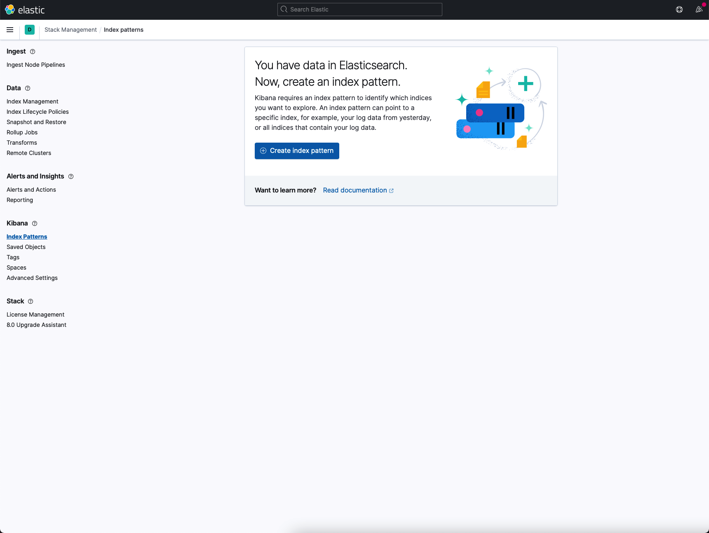

OV05 BS-Testing Cofiguration Documentation
==========================================

Basic Pump Template
-------------------------
This is generic pump template you can use for your app.
::
    #!/usr/bin/env python3

    import bspump
    import bspump.common
    import bspump.http
    import asab

    # There is place for your processors

    class SamplePipeline(bspump.Pipeline):

        def __init__(self, app, pipeline_id):
            super().__init__(app, pipeline_id)

            self.build(
                # Source of data in pipeline triggered every 5 sec you can replace it for your desired source
                bspump.http.HTTPClientSource(app, self, config={
                   'url': 'https://api.coindesk.com/v1/bpi/currentprice.json'
                }).on(bspump.trigger.PeriodicTrigger(app, 5)),
                # Processor which convert JSON to Python dictionary
                bspump.common.StdJsonToDictParser(app, self),
                # Sink for printing data to terminal
                bspump.common.PPrintSink(app, self),
            )

    if __name__ == '__main__':
        app = bspump.BSPumpApplication()

        svc = app.get_service("bspump.PumpService")

        # Construct and register Pipeline
        pl = SamplePipeline(app, 'SamplePipeline')
        svc.add_pipeline(pl)

        app.run()

Blank app structure
-------------------
It is a good practice to have your app in blank app structure like in this tutorial TODO...

Running your pump with configuration file
-----------------------------------------
When you want to run your pump with configuration you can do it this way

In Terminal
^^^^^^^^^^^
In terminal you have to use ``-c`` flag in your command like this
::
    ~ python3 nameOfYourPump.py -c nameOfYourConfig.conf

In your IDE
^^^^^^^^^^^
When you want to run your pump in IDE you have to set the run parameters. For example in PyCharm go to Run -> Edit Configurations...
and then change the parameters to ``-c nameOfYourPump.conf``.

More about configuration files is `here <https://bitswanpump.readthedocs.io/en/latest/examples/configquickstart/configquickstart.html>`_

Elastic search connection
-------------------------
Import Elastic Search module from BSPump
::
    import bspump
    import bspump.common
    import bspump.http
    import bspump.elasticsearch
    import asab

Add Elastic Search connection to main function:
::
       if __name__ == '__main__':
        app = bspump.BSPumpApplication()

        svc = app.get_service("bspump.PumpService")

        # Adding Elastic Search connection here
        es_connection = bspump.elasticsearch.ElasticSearchConnection(app, "ESConnection")
        svc.add_connection(es_connection)

        # Construct and register Pipeline
        pl = SamplePipeline(app, 'SamplePipeline')
        svc.add_pipeline(pl)

        app.run()

Sink
^^^^
If you want to upload your data to Elastic Search index create ``.conf`` file with following config, change ``INDEX-NAME`` to your desired
index and ``PIPELINE-NAME`` to name of your pipline:
::
    # Elasticsearch connection
    [connection:ESConnection]
    url=http://10.17.168.197:9200

    # Elasticsearch sink
    [pipeline:PIPELINE-NAME:ElasticSearchSink]
    index=INDEX-NAME
    doctype=_doc

Then add ``bspump.elasticsearch.ElasticSearchSink`` to your pipeline like this:
::
    self.build(
                # Source of data in pipeline triggered every 5 sec you can replace it for your desired source
                bspump.http.HTTPClientSource(app, self, config={
                   'url': 'https://api.coindesk.com/v1/bpi/currentprice.json'
                }).on(bspump.trigger.PeriodicTrigger(app, 5)),
                # Processor which convert JSON to Python dictionary
                bspump.common.StdJsonToDictParser(app, self),
                # Sink to upload data to Elastic Search topic
                bspump.elasticsearch.ElasticSearchSink(app, self, "ESConnection"),
            )

Source
^^^^^^
If you want to get data from Elastic Search topic your ``.conf`` file have to looks like this, change ``INDEX-NAME`` tou your index
and ``PIPELINE-NAME`` to name of your pipeline:
::
    # Elasticsearch connection
    [connection:ESConnection]
    url=http://10.17.168.197:9200

    # Elasticsearch source
    [pipeline:PIPELINE-NAME:ElasticSearchSource]
    index=INDEX-NAME

Then add ``bspump.elasticsearch.ElasticSearchSource`` with ``PeriodicTrigger``
::
            self.build(
                # Elastic Search source which get data every 5 sec
                bspump.elasticsearch.ElasticSearchSource(app, self, "ESConnection").on(bspump.trigger.PeriodicTrigger(app, 5)),
                # Processor which convert JSON to Python dictionary
                bspump.common.StdJsonToDictParser(app, self),
                # Sink for printing data to terminal
                bspump.common.PPrintSink(app, self),
            )

Kibana UI
^^^^^^^^^
Kibana is UI for Elastic Search databases and to create dashboards from our stored data. You can access Kibana on bs-testing through
this url https://bs-testing/kibana/app/home#/ you can also browse your data in Index Management, etc.

When you go to that url you should see this page

.. image:: kibana1.png
    :width: 800
    :align: center
    :alt: Kibana Home Page

You can browse through indexes `here <https://bs-testing/kibana/app/management/data/index_management/indices>`_

When you want to create your dashboard you have to first make index pattern from your index. You can create index pattern
`here <https://bs-testing/kibana/app/management/kibana/indexPatterns>`_

When you have your index pattern you can create dashboard `here <https://bs-testing/kibana/app/dashboards#/create?_g=(filters:!(),refreshInterval:(pause:!t,value:0),time:(from:now-15m,to:now))&_a=(description:'',filters:!(),fullScreenMode:!f,options:(hidePanelTitles:!f,useMargins:!t),panels:!(),query:(language:kuery,query:''),tags:!(),timeRestore:!f,title:'',viewMode:edit)>`_

Kafka Connection
----------------
Import Kafka module from BSPump
::
    import bspump
    import bspump.common
    import bspump.http
    import bspump.kafka
    import asab

Add Kafka connection to main function:
::
       if __name__ == '__main__':
        app = bspump.BSPumpApplication()

        svc = app.get_service("bspump.PumpService")

        # Adding Kafka connection here
        svc.add_connection(
        bspump.kafka.KafkaConnection(app, "KafkaConnection")
        )

        # Construct and register Pipeline
        pl = SamplePipeline(app, 'SamplePipeline')
        svc.add_pipeline(pl)

        app.run()

Sink
^^^^
If you want to stream your data in Kafka topic create ``.conf`` file with following config (change ``TOPIC-NAME`` to your topic
and ``PIPELINE-NAME`` to name of your pipeline):
::
    [connection:KafkaConnection]
    bootstrap_servers=10.17.168.197

    # Elasticsearch sink
    [pipeline:PIPELINE-NAME:KafkaSink]
    topic=TOPIC-NAME
Then add ``bspump.kafka.KafkaSink`` to your pipeline like this:
::
    self.build(
                # Source of data in pipeline triggered every 5 sec you can replace it for your desired source
                bspump.http.HTTPClientSource(app, self, config={
                   'url': 'https://api.coindesk.com/v1/bpi/currentprice.json'
                }).on(bspump.trigger.PeriodicTrigger(app, 5)),
                # Processor which convert JSON to Python dictionary
                bspump.common.StdJsonToDictParser(app, self),
                # Sink to stream data to Kafka topic
                bspump.kafka.KafkaSink(app, self, "KafkaConnection"),
            )

Source
^^^^^^
If you want to stream data from Kafka topic create ``.conf`` file with following config (change ``TOPIC-NAME`` and ``PIPELINE-NAME``):
::
    # KafkaConnection
    [connection:KafkaConnection]
    bootstrap_servers=10.17.168.197:9092

    # Kafka source ACS
    [pipeline:PIPELINE-NAME:KafkaSource]
    topic=TOPIC-NAME

Add ``bspump.kafka.KafkaSource``to your pipeline:
::
            self.build(
                # Elastic Search source which get data every 5 sec
                bspump.kafka.KafkaSource(app, self, "KafkaConnection"),
                # Processor which convert bytes to string because Kafka stream is in bytes
                bspump.common.BytesToStringParser(app, self),
                # Processor which convert JSON to Python dictionary
                bspump.common.StdJsonToDictParser(app, self),
                # Sink to stream data from Kafka topic
                bspump.common.PPrintSink(app, self),
            )

KafkaDrop
^^^^^^^^^
KafkaDrop is UI for Kafka. You can manage your topics and see info about brokers here. KafkaDrop is accessible via https://bs-testing/kafka-ui/

You should see this home page

You can see there are already some topics. When you click on one of them you can show info about topic and its partition.

When you want to see which data are stored in topic click on ``View Messages``. Set from which partition you want to view data, offset,
messages limit, key format and message format and click ``View Messages`` again.

You should see specific messages in topic and its timestamps

InfluxDB Connection
-------------------
First you have to connect to bs-testing server and create database in InfluxDB container. When you are connected on bs-testing type
this command:
::
    root@bs-testing:~ docker exec -it single_lm01-influxdb_1 bash

Now you are in InfluxDB container. To enter the InfluxDB type:
::
    root@72bfd8803691:/ influx
Create new database and insert new measurements
^^^^^^^^^^^^^^^^^^^^^^^^^^^^^^^^^^^^^^^^^^^^^^^
When you are in InfluxDB you can show all your databases with ``show databases`` command.

Output:
::
    name: databases
    name
    ----
    db0
    _internal
    ...

To create new database type ``create database DATABASE-NAME`` and change ``DATABASE-NAME`` with name of your desired database.

Now when you type ``show databases`` again you should see this:
::
    name: databases
    name
    ----
    db0
    _internal
    ...
    DATABASE-NAME

Now you have to enter your desired database with ``use DATABASE-NAME`` command (change ``DATABASE-NAME`` with your database).

When you are in your database you can display all your measurements with ``show measurements`` command. When your database is empty you will see nothing.

You can insert new measurement with ``INSERT`` command, for example:
::
    INSERT cpu,host=serverA value 1

Sink
^^^^
If you want to insert data to your InfluxDB with your pump you have to add import ``bspump.influxdb`` module:
::
    import bspump
    import bspump.common
    import bspump.http
    import bspump.influxdb
    import asab

Add InfluxDB Connection to main function of your pump
::
    if __name__ == '__main__':
        app = bspump.BSPumpApplication()

        svc = app.get_service("bspump.PumpService")

        # Adding InfluxDB Connection here
        svc.add_connection(
            bspump.influxdb.InfluxDBConnection(app, "InfluxConnection")
        )

        # Construct and register Pipeline
        pl = SamplePipeline(app, 'SamplePipeline')
        svc.add_pipeline(pl)

        app.run()

Now you have to set you ``.conf`` file with this configuration (change ``YOUR-DB-NAME`` to name of your database):
::
    # InfluxDB Connection
    [connection:InfluxConnection]
    url=http://10.17.168.197:8086
    db= YOUR-DB-NAME

Add ``bspump.influxdb.InfluxDBSink`` to your pipeline:
::
        self.build(
            bspump.http.HTTPClientSource(app, self, config={
                'url': 'https://api.coindesk.com/v1/bpi/currentprice.json'
            }).on(bspump.trigger.PeriodicTrigger(app, 5)),
            # Processor used to print data to terminal
            bspump.common.PPrintProcessor(app, self),
            # Sink which send data to InfluxDB
            bspump.influxdb.InfluxDBSink(app, self, "InfluxConnection")
        )

Grafana
^^^^^^^
Grafana is UI for creating dashboard from a multiple data sources like InfluxDB, Elastic, MySQL ,etc. We will use it for creating dashboard from InfluxDB records.
Grafana is accessible via http://bs-testing:3000

You should see this home page

First you have to add your data source, which is database where you have your measurements. You can find data sources
`here <http://bs-testing:3000/datasources>`_

Click on ``Add data source`` option and choose ``InfluxDB``. Define name of your data source, change url of source to http://bs-testing:8086, and
specify name of your database.

Now you can create dashboard `here <http://bs-testing:3000/dashboard/new?orgId=1>`_.

