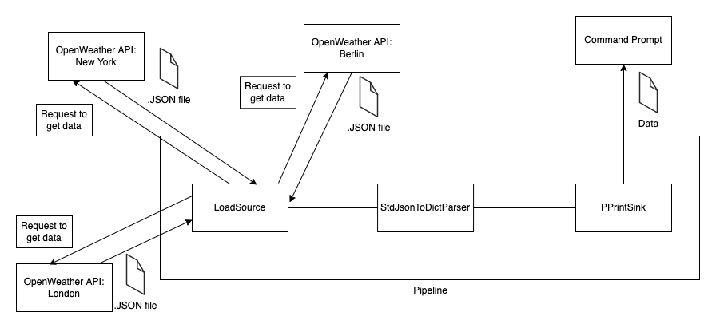

Weather API Example
===================
About
-----
In this example we will learn how get data from one or multiple HTTP sources using an API request. In this case we cannot use basic
HTTPClientSource, because it returns data only from one API query, so to get data from different queries we will have
to define a new source for this use case.

The final pipeline will get data from multiple API requests in one time as a JSON, convert it to python
dictionary, and output the data to Command Prompt.

In this example we will be using API from `Open Weather <https://openweathermap.org/>`_ to get current weather data (e.g, temperature,
feels like temperature, biometric pressure etc).

In this example we will use ``.conf`` file to store configuration for our pump. More about how to write configuration is
here :ref:`config`.

A diagram of the finished pipeline

Pipeline
--------

In the code below you can see the structure of ``SamplePipeline`` which we need for this use case. The important part is the
``self.build()`` method where its parameters are the single components of the pipeline. Do not forget that every pipeline
requires both source and sink to function correctly.

`Source` is a component that supply the pipeline with data. In our example we will use a specific type of source. Because we need
to Pump data from API. We need to send request to the API to receive our data. This means that our source has to be
“trigger” when we get our response. For this reason we will be using a so-called trigger source. More about :ref:`trigger`.

Because we are using `Trigger Source`. We need to specify which trigger we will be using. There are more types of triggers,
but in our example we will be using PeriodicTrigger, which triggers in time intervals specified in the parameter.
``bspump.trigger.PeriodicTrigger(app, <<Time parameter in seconds>>))``

Each pipeline requires a sink. In our example we want to see the result of the data, so we will be using PPrintSink
which simply prints the data to the Command Prompt.

You can try to copy-paste this chunk of code and try it yourself. You must have BSPump module installed. Follow our guide :ref:`bsmodule`.

Simply rewrite ``<<LOCATION>>`` to whatever city you want to get weather data from and put your API key which you will get after register on https://openweathermap.org/ to ``<<YOUR PRIVATE API KEY>>`` section.
::
    #!/usr/bin/env python3

    import bspump
    import bspump.common
    import bspump.http
    import bspump.trigger

    class SamplePipeline(bspump.Pipeline):

        def __init__(self, app, pipeline_id):
            super().__init__(app, pipeline_id)

            self.build(
                bspump.http.HTTPClientSource(app, self, config={
                    'url': 'https://api.openweathermap.org/data/2.5/weather?q=<<LOCATION>>&units=metric&appid=<<YOUR PRIVATE API KEY>>'
                }).on(bspump.trigger.PeriodicTrigger(app, 5)),
                bspump.common.PPrintSink(app, self),
            )

    if __name__ == '__main__':
        app = bspump.BSPumpApplication()
        svc = app.get_service("bspump.PumpService")
        pl = SamplePipeline(app, 'SamplePipeline')
        svc.add_pipeline(pl)
        app.run()

You should get output like this:
::
    ~python3 example.py
    BitSwan BSPump version 21.11-17-g6b346fd
    27-Jan-2022 18:43:00.177421 NOTICE asab.application is ready.
    1 pipeline(s) ready.
    (b'{"coord":{"lon":-0.1257,"lat":51.5085},"weather":[{"id":802,"main":"Clouds",'
    b'"description":"scattered clouds","icon":"03n"}],"base":"stations","main":{"t'
    b'emp":8.91,"feels_like":6.86,"temp_min":6.8,"temp_max":10.14,"pressure":1030,'
    b'"humidity":71},"visibility":10000,"wind":{"speed":3.6,"deg":290},"clouds":{"'
    b'all":35},"dt":1643304840,"sys":{"type":2,"id":2019646,"country":"GB","sunris'
    b'e":1643269577,"sunset":1643301595},"timezone":0,"id":2643743,"name":"London"'
    b',"cod":200}')

Multiple location source
------------------------

In the code above, the pump simply returns data from one location. But in our use case we need to get data from multiple
locations, which means we need to get data from multiple API's URL. Next, we decide which trigger source we will use.
::
    class LoadSource(bspump.TriggerSource):

        def __init__(self, app, pipeline, choice=None, id=None, config=None):
            super().__init__(app, pipeline, id=id, config=config)
            self.cities = ['London','New York','Berlin'] #List of cities

        async def cycle(self):
            async with aiohttp.ClientSession() as session:
                #goes through the list of cities and requests from API for each city
                for city in self.cities:
                    async with session.get(url=self.Config['url'].format(city=city, api_key=self.Config['api_key'])) as response:
                        event = await response.content.read()
                        await self.process(event)

You can see that in this example we are using ``self.Config`` method to get the API key and the url from the configuration file. It is
good to have the API key and the url in configuration file, because changes can be made simply in the configuration file.

For example, create a ``weather-pump.conf`` file, and into that file you can copy/paste code below
::
    [pipeline:SamplePipeline:LoadSource]
    url = https://api.openweathermap.org/data/2.5/weather?q={city}&units=metric&appid={api_key}
    api_key = <<YOUR PRIVATE API KEY>>

When you run your pump with configuration file you have to run it with ``-c`` switch. So after you finish your pump and you need to test it, type ``python3 weather-pump.py -c weather-pump.conf`` to the terminal.

You can change the list of cities to any locations you wish. The important part of this source is ``async def cycle(self)``
method where we request the API's url for every location from our list and process them in the pipeline.

Just be sure that you import ``aiohttp`` package and you change ``HTTPClientSource`` with our new specified ``LoadSource``.

You can copy/paste the final code here:
::
    #!/usr/bin/env python3

    import bspump
    import bspump.common
    import bspump.http
    import bspump.trigger
    import aiohttp

    class LoadSource(bspump.TriggerSource):

        def __init__(self, app, pipeline, choice=None, id=None, config=None):
            super().__init__(app, pipeline, id=id, config=config)
            self.cities = ['London','New York','Berlin'] #List of cities

        async def cycle(self):
            async with aiohttp.ClientSession() as session:
                #goes through the list of cities and requests from API for each city
                for city in self.cities:
                    async with session.get(url=self.Config['url'].format(city=city, api_key=self.Config['api_key'])) as response:
                        event = await response.content.read()
                        await self.process(event)

    class SamplePipeline(bspump.Pipeline):

        def __init__(self, app, pipeline_id):
            super().__init__(app, pipeline_id)

            self.build(
                LoadSource(app, self).on(
                    bspump.trigger.PeriodicTrigger(app, 5)
                ),
                bspump.common.PPrintSink(app, self),
            )
    if __name__ == '__main__':
            app = bspump.BSPumpApplication()
            svc = app.get_service("bspump.PumpService")
            pl = SamplePipeline(app, 'SamplePipeline')
            svc.add_pipeline(pl)
            app.run()

After you execute this code you should get this output in terminal:
::
   ~ python3 example.py -c example.conf
    BitSwan BSPump version 21.11-17-g6b346fd
    27-Jan-2022 18:56:14.058308 NOTICE asab.application is ready.
    1 pipeline(s) ready.
    (b'{"coord":{"lon":-0.1257,"lat":51.5085},"weather":[{"id":802,"main":"Clouds",'
    b'"description":"scattered clouds","icon":"03n"}],"base":"stations","main":{"t'
    b'emp":8.79,"feels_like":6.72,"temp_min":6.8,"temp_max":10.14,"pressure":1030,'
    b'"humidity":70},"visibility":10000,"wind":{"speed":3.6,"deg":290},"clouds":{"'
    b'all":35},"dt":1643305383,"sys":{"type":2,"id":2019646,"country":"GB","sunris'
    b'e":1643269577,"sunset":1643301595},"timezone":0,"id":2643743,"name":"London"'
    b',"cod":200}')
    (b'{"coord":{"lon":-74.006,"lat":40.7143},"weather":[{"id":801,"main":"Clouds",'
    b'"description":"few clouds","icon":"02d"}],"base":"stations","main":{"temp":-'
    b'1.13,"feels_like":-1.13,"temp_min":-3.36,"temp_max":0.9,"pressure":1030,"hum'
    b'idity":51},"visibility":10000,"wind":{"speed":0.45,"deg":34,"gust":1.34},"cl'
    b'ouds":{"all":19},"dt":1643305980,"sys":{"type":2,"id":2039034,"country":"US"'
    b',"sunrise":1643285428,"sunset":1643321212},"timezone":-18000,"id":5128581,"n'
    b'ame":"New York","cod":200}')
    (b'{"coord":{"lon":13.4105,"lat":52.5244},"weather":[{"id":803,"main":"Clouds",'
    b'"description":"broken clouds","icon":"04n"}],"base":"stations","main":{"temp'
    b'":6.01,"feels_like":1.09,"temp_min":5.01,"temp_max":6.85,"pressure":1003,"hu'
    b'midity":91},"visibility":10000,"wind":{"speed":9.39,"deg":251,"gust":15.2},"'
    b'clouds":{"all":75},"dt":1643305512,"sys":{"type":2,"id":2011538,"country":"D'
    b'E","sunrise":1643266558,"sunset":1643298116},"timezone":3600,"id":2950159,"n'
    b'ame":"Berlin","cod":200}')

Connect to ES
-------------

You can change and modify the pipeline in any manner you want. For example, instead of using PPrintSink you can use our Elastic Search Sink which loads the data to Elastic Search. If you want to read more about :ref:`esconnection`.
